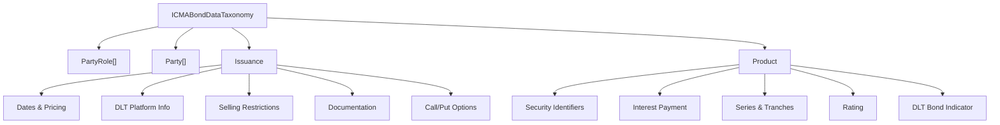
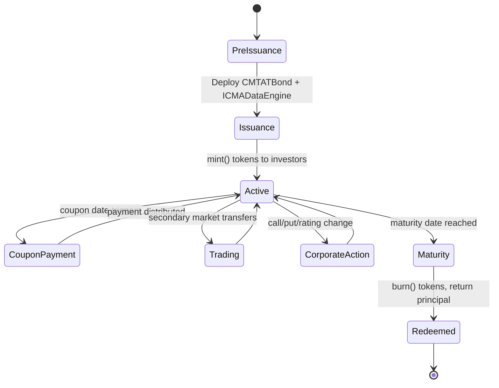
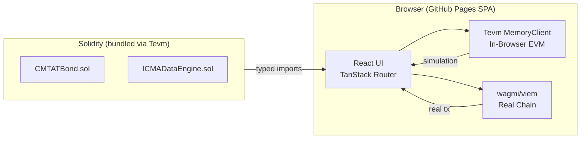
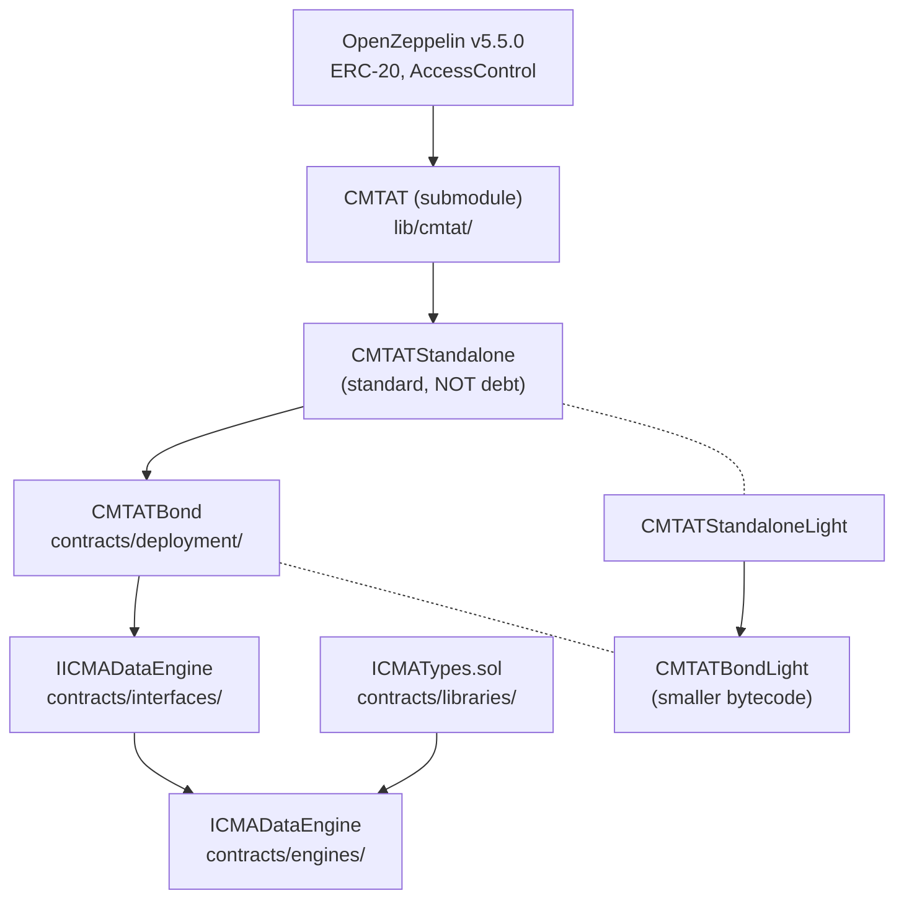

# Research Note: CMTAT-ICMA Tokenized Bond Lifecycle Sandbox

> Full client-side bond lifecycle sandbox — deployable as GitHub Pages SPA, powered by Tevm in-memory EVM, CMTAT standard token, and ICMA Bond Data Taxonomy v1.2.

---

## 1. Standards Integration Landscape

### 1.1 MAS Guardian Fixed Income Framework (GFIF)

Published by the Monetary Authority of Singapore (Nov 2024), the GFIF is the **first industry guide specifically for tokenized debt capital markets**. It integrates three standards:

| Standard | Owner | Role in GFIF |
|----------|-------|-------------|
| **ICMA Bond Data Taxonomy** | ICMA | Data model — 90+ machine-readable fields for bond term sheets |
| **CMTAT Token Standard** | CMTA (Swiss) | Smart contract framework — modular ERC-20 with compliance modules |
| **GFMA Design Principles** | GFMA | Governance — principles for tokenized securities interoperability |

**Key GFIF 2025 priorities** (ICMA-led):
- Delivery vs Payment (DvP) settlement for DLT bonds
- Custody arrangements for DLT-based debt securities
- SGD wholesale CBDC for settlement (MAS)
- Cross-border interoperability across jurisdictions

### 1.2 ICMA Bond Data Taxonomy v1.2

The BDT provides a **technology-agnostic, machine-readable schema** (XSD) covering the full bond term sheet. The schema has **4 top-level blocks**:



**Key ICMA fields relevant to on-chain representation:**

| Category | Fields | On-chain? |
|----------|--------|-----------|
| **Identifiers** | ISIN, CUSIP, SEDOL, DTI, Common Code, WKN | ICMADataEngine |
| **Issuance** | SpecifiedDenomination, Currency, PricingDate, IssueDate, SettlementDate, IssuePrice | ICMADataEngine |
| **Product** | AggregateNominalAmount, MaturityDate, FormOfNote, StatusOfNote | ICMADataEngine |
| **Interest** | InterestType (Fixed/Floating/Zero), InterestRate, PaymentFrequency, DayCountFraction | ICMADataEngine |
| **DLT** | DltPlatform.Type, Accessibility, TokenType, TokenTechnicalReference, SmartContract address | Auto from deployment |
| **Parties** | PartyRole (ISSUER, REGISTRAR, PLATFORM_OPERATOR), LEI, PartyName | ICMADataEngine |
| **Floating Rate** | Benchmark (SOFR, EURIBOR), Margin, DeterminationMethod, ObservationMethod | ICMADataEngine |
| **Redemption** | FinalRedemptionAmountPercentage, CallPutOption, OptionalRedemption dates/amounts | ICMADataEngine |
| **Compliance** | SellingRestrictions, PRIIPs, ManufacturerTargetMarket, GoverningLaw | RuleEngine |

**DLT-specific fields from XSD** (lines 739-807):
- `DltPlatformOperationalInformation`: Type (Ethereum), Accessibility (PUBLIC/PRIVATE/PERMISSIONED), Role, Operator, TokenType, TokenTechnicalReference (ERC-20), SmartContract (contract address), PlatformIdentifier (MIC, LEI, DTI, BlockchainAddress)

**Real-world example** (Société Générale FORGE, from ICMA DLT Example 1):
- Issuer: SOCIETE GENERALE SFH (LEI: 969500KN90DZLHUN3566)
- Platform: Ethereum, Public, ERC-20
- EUR 40M, 0% coupon, Fixed rate, Annual payments
- ISIN: FR0013510518, Maturity: 2025-05-14

### 1.3 CMTAT Architecture Deep Dive

CMTAT is **modular by design** — modules can be mixed and matched. The architecture:

```
CMTATBase
├── CoreModule (ERC-20, name/symbol/decimals)
├── PauseModule (pause/unpause transfers)
├── EnforcementModule (freeze accounts)
├── ValidationModule → RuleEngine (transfer restrictions)
├── MetaTxModule (ERC-2771 gasless)
├── SnapshotModule → SnapshotEngine
├── DocumentModule → DocumentEngine (ERC-1643)
└── DebtModule → DebtEngine (debt info + credit events)
```

**Deployment variants and sizes:**

| Variant | Includes | Contract Size |
|---------|----------|--------------|
| `CMTATStandalone` | All standard modules | ~22KB |
| `CMTATStandaloneLight` | Core modules only | ~14KB |
| `CMTATStandaloneDebt` | Standard + DebtModule | ~24KB (near limit!) |
| `CMTATStandaloneDebtEngine` | Standard + DebtEngineModule | ~23KB |

**Critical insight from the CMTAT team feedback:**

> *"Since you implement the ICMA taxonomy, I'd recommend inheriting from the standard version rather than the debt version. This would help reduce contract size and avoid redundant debt attributes between the ICMA and CMTA debt specifications."*

This is because CMTAT's `DebtModule` stores: `issuerName`, `issuerDescription`, `guarantor`, `debtHolder`, `interestRate`, `parValue`, `maturityDate`, `couponPaymentFrequency`, `dayCountConvention`, `currency` — which **overlap 80%** with ICMA BDT fields. Using standard CMTAT + external ICMADataEngine avoids double-storing these attributes.

**CMTAT as Git Submodule** (official recommendation):

> *"We recommend including it as a library via a GitHub submodule rather than creating a fork. This approach keeps your changes separate from the upstream CMTAT codebase and makes it easier to upgrade to newer versions."*

Config: Solidity v0.8.34, Optimizer 200 runs, OpenZeppelin v5.5.0

---

## 2. Bond Lifecycle — On-Chain Stages

The sandbox must model the **complete lifecycle** of a tokenized bond. Here's the mapping from traditional stages to smart contract operations:



### Lifecycle Stage → Smart Contract Mapping

| Stage | Traditional | On-Chain Operations | CMTAT Module |
|-------|-------------|---------------------|--------------|
| **1. Pre-Issuance** | Term sheet, roadshow, pricing | Deploy contracts, set ICMA data | Constructor + ICMADataEngine |
| **2. Issuance** | Signing, closing, delivery | `mint()` tokens to investor wallets | MintModule |
| **3. KYC/AML** | Investor accreditation | RuleEngine validates transfers | ValidationModule |
| **4. Settlement** | T+2 DvP | Atomic `transferFrom()` with payment | ERC-20 + RuleEngine |
| **5. Coupon Payment** | Semi-annual interest | Admin distributes pro-rata payments | Custom: CouponEngine |
| **6. Secondary Trading** | OTC / exchange | Standard `transfer()` / `transferFrom()` | ERC-20 + ValidationModule |
| **7. Freeze/Pause** | Regulatory halt | `freeze(address)` / `pause()` | EnforcementModule / PauseModule |
| **8. Corporate Actions** | Rating change, restructure | Update ICMADataEngine credit events | ICMADataEngine |
| **9. Call / Put** | Optional early redemption | `burn()` + ICMA optional redemption data | MintModule + ICMADataEngine |
| **10. Maturity** | Principal repayment | `burn()` all tokens | MintModule |
| **11. Deactivation** | Archive | `deactivate()` contract | PauseModule |

### Coupon Payment Engine (Custom)

CMTAT doesn't include a coupon distribution module. We need to build one:

```solidity
// Simplified concept — distribute to all token holders pro-rata
function distributeCoupon(uint256 totalCouponAmount) external onlyRole(COUPON_MANAGER_ROLE) {
    // Snapshot balances, distribute proportionally
    // Uses SnapshotEngine for record date captures
}
```

---

## 3. Tevm Integration — Client-Side EVM

### 3.1 Why Tevm for This Project

| Feature | Benefit for Bond Sandbox |
|---------|------------------------|
| **In-memory EVM** | Run entire bond lifecycle in-browser — no backend needed |
| **Chain forking** | Fork Sepolia/mainnet for realistic testing |
| **Solidity imports** | `import { CMTATBond } from './contracts/CMTATBond.sol'` — typed! |
| **Vite plugin** | First-class integration with our Vite+React stack |
| **GitHub Pages** | Pure SPA — no server required |
| **Optimistic UX** | Simulate tx before sending on-chain (instant feedback) |

### 3.2 Architecture for Client-Side Sandbox



**Dual-mode operation:**

1. **Sandbox Mode** (default): Pure Tevm in-memory — deploy, trade, simulate lifecycle, no wallet needed
2. **Live Mode** (optional): Connect wallet via wagmi → deploy to real testnet → read from live contracts

### 3.3 Vite Configuration

```typescript
// vite.config.ts
import { defineConfig } from 'vite'
import react from '@vitejs/plugin-react'
import { vitePluginTevm } from 'tevm/bundler/vite-plugin'

export default defineConfig({
  plugins: [react(), vitePluginTevm()],
  base: '/cmtat-icma-tokenized-bonds/', // GitHub Pages subpath
})
```

### 3.4 Typed Contract Interaction Pattern

```typescript
import { createMemoryClient } from 'tevm'
import { CMTATBond } from '../contracts/deployment/CMTATBond.sol'
import { ICMADataEngine } from '../contracts/engines/ICMADataEngine.sol'

const client = createMemoryClient()

// Deploy ICMADataEngine
const engineResult = await client.tevmDeploy(
  ICMADataEngine.deploy(adminAddress)
)

// Deploy CMTATBond pointing to engine
const bondResult = await client.tevmDeploy(
  CMTATBond.deploy(adminAddress, 'SG Bond 2025', 'SGB25', engineResult.createdAddress)
)

// Read ICMA data with full type safety
const bondData = await client.readContract(
  ICMADataEngine.withAddress(engineResult.createdAddress).read.bondStaticData()
)
```

---

## 4. Smart Contract Architecture

### 4.1 Contract Hierarchy



### 4.2 ICMADataEngine Design

Three data structs aligned with the XSD:

**BondStaticData** (from Issuance + Product):
```solidity
struct BondStaticData {
    string isin;                    // SecurityIdentifier.ISIN
    string issuerLei;               // Party.LEIIdentifier
    string issuerName;              // Party.PartyName
    string currency;                // Issuance.SpecifiedCurrency
    uint256 denomination;           // Issuance.SpecifiedDenomination
    uint256 aggregateNominalAmount; // Product.AggregateNominalAmount
    string issuanceDate;            // Issuance.IssueDate
    string maturityDate;            // Product.MaturityDate
    string formOfNote;              // Product.FormOfNote
    string statusOfNote;            // Product.StatusOfNote
    string governingLaw;            // Issuance.GoverningLaw
    bool dltBondIndicator;          // Product.DLTBondIndicator
}
```

**BondTerms** (from Product.InterestPayment):
```solidity
struct BondTerms {
    string interestType;            // Fixed, Floating, Zero
    uint256 interestRateBps;        // basis points (e.g., 350 = 3.50%)
    string paymentFrequency;        // ANNUALLY, SEMI_ANNUALLY, QUARTERLY
    string dayCountFraction;        // ACT/ACT, 30/360, ACT/365
    string businessDayConvention;   // FOLLOWING, MODIFIED_FOLLOWING
    string interestCommencementDate;
    uint256 finalRedemptionPct;     // 100 = par
}
```

**CreditEvents** (lifecycle updates):
```solidity
struct CreditEvents {
    bool flagDefault;
    bool flagRedeemed;
    string rating;
    string ratingAgency;
}
```

### 4.3 Contract Size Budget

| Contract | Est. Size | Under 24KB? |
|----------|-----------|-------------|
| CMTATBond (inherits Standard) | ~22.5KB | ✅ |
| CMTATBondLight (inherits Light) | ~15KB | ✅ |
| ICMADataEngine (standalone) | ~8KB | ✅ |
| Total deployment (2 contracts) | ~30.5KB | ✅ (split!) |

By using the **engine pattern** (ICMADataEngine as separate contract), we keep CMTATBond size manageable even with all CMTAT modules.

---

## 5. Frontend Architecture

### 5.1 TanStack Start with SPA Mode (GitHub Pages)

TanStack Start supports static prerendering with SPA mode:

```typescript
// app.config.ts
import { defineConfig } from '@tanstack/react-start/config'

export default defineConfig({
  spa: { enabled: true },  // Disable SSR for all routes
  server: {
    prerender: { routes: ['/'] }  // Generate static HTML
  }
})
```

**However**, for a pure client-side sandbox, **Vite + TanStack Router** (without Start) is actually the simpler and more battle-tested approach for GitHub Pages. Start adds SSR/prerender complexity we don't need.

**Recommended: Vite + TanStack Router (SPA)**

### 5.2 Route Structure

```
/                           → Dashboard / Bond Universe
/deploy                     → Deploy new bond (Tevm simulation + live)
/bond/:address              → Bond detail view
/bond/:address/lifecycle    → Lifecycle timeline + actions
/bond/:address/icma         → Full ICMA taxonomy data
/bond/:address/compliance   → CMTAT compliance (freeze, pause, rules)
/bond/:address/trading      → Secondary trading simulation
/bond/:address/coupon       → Coupon payment schedule + distribution
/settings                   → Network config, sandbox vs live mode
```

### 5.3 Key UI Panels

1. **Bond Deploy Wizard** — Step-by-step: set ICMA static data → deploy ICMADataEngine → deploy CMTATBond → mint tokens → done
2. **Lifecycle Timeline** — Visual timeline showing current stage (Pre-Issuance → Active → Maturity) with action buttons at each stage
3. **ICMA Data Inspector** — Read all ICMADataEngine data, display in taxonomy-aligned panels (matches XSD structure)
4. **Trading Simulator** — Transfer tokens between simulated accounts in Tevm
5. **Coupon Dashboard** — View payment schedule, simulate coupon distribution
6. **Compliance Panel** — Freeze/unfreeze accounts, pause contract, manage RuleEngine

### 5.4 Tech Stack Summary

| Layer | Technology | Why |
|-------|-----------|-----|
| **Framework** | Vite + React 18 | Fast dev, Tevm plugin support |
| **Routing** | TanStack Router | Type-safe, file-based |
| **UI** | Mantine v7 | Comprehensive, dark mode, professional |
| **Charts** | Recharts | Bond analytics, yield curves |
| **EVM (Sandbox)** | Tevm `createMemoryClient` | In-browser, no backend |
| **EVM (Live)** | wagmi + viem | Real wallet + testnet |
| **Contracts** | CMTAT (submodule) + custom | Standard inheritance |
| **Solidity** | v0.8.28+ | Optimizer 200 runs |
| **Deployment** | GitHub Pages | Static SPA, free hosting |

---

## 6. Key Decisions & Trade-offs

| Decision | Chosen | Alternative | Rationale |
|----------|--------|-------------|-----------|
| CMTAT base | Standard (not Debt) | Debt | Avoids field duplication with ICMA; smaller contract |
| CMTAT integration | Git submodule | npm / copy | Official recommendation; easy version management |
| ICMA data storage | External ICMADataEngine | In-contract | Engine pattern; keeps CMTATBond < 24KB |
| Frontend framework | Vite + TanStack Router | TanStack Start | Pure SPA for GitHub Pages; no SSR needed |
| EVM runtime | Tevm in-memory | Hardhat node | Client-side only; no backend server |
| Coupon payments | Custom CouponEngine | Off-chain | On-chain transparency; simulated via Tevm |

---

## 7. Implementation Phases

| Phase | Scope | Deliverable |
|-------|-------|-------------|
| **0** | Clone repo, add CMTAT submodule, clean project | Working repo with submodule |
| **1** | Smart contracts: ICMATypes, IICMADataEngine, ICMADataEngine, CMTATBond | Compilable contracts < 24KB |
| **2** | Tevm integration: vite config, typed imports, memory client | Working client-side EVM |
| **3** | Frontend: deploy wizard, lifecycle timeline, ICMA inspector | Functional sandbox UI |
| **4** | Testing: Hardhat unit tests, Tevm integration tests | Verified contracts |
| **5** | Polish: GitHub Pages deployment, GitHub Actions CI | Live demo |

---

## 8. References

- [MAS Project Guardian](https://www.mas.gov.sg/schemes-and-initiatives/project-guardian)
- [Guardian Fixed Income Framework (GFIF)](https://www.mas.gov.sg/-/media/mas-media-library/development/fintech/guardian/guardian-fixed-income-framework.pdf)
- [ICMA Bond Data Taxonomy](https://www.icmagroup.org/market-practice-and-regulatory-policy/secondary-markets/bond-market-transparency/icma-bond-data-taxonomy/)
- [CMTAT GitHub](https://github.com/CMTA/CMTAT)  
- [CMTAT Debt Instruments Standard](https://cmta.ch/standards/standard-for-the-tokenization-of-debt-instruments-using-distributed-ledger-technology)
- [Tevm Documentation](https://node.tevm.sh/getting-started/overview)
- [Tevm Bundler Quickstart](https://node.tevm.sh/getting-started/bundler)
- [ICMA DLT Bonds Reference Guide](https://www.icmagroup.org/market-practice-and-regulatory-policy/fintech-and-digitalisation/fintech-resources/dlt-and-blockchain-in-bond-markets/)
- [GFMA Tokenization Design Principles](https://www.gfma.org/policies-resources/gfma-tokenization-design-principles/)
